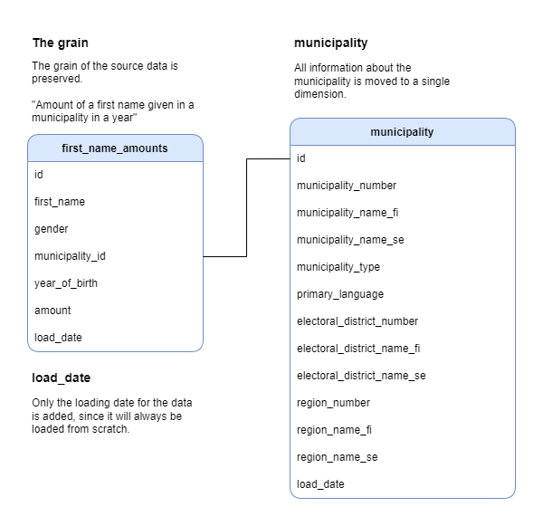

# Most popular first names by municipality in Finland

This is an ETL process for creating a datamodel for reporting popular first names and their distribution across municipalities in Finland.



The code in the **Jupyter Notebook** is divided into 3 parts: creation of the municipality dimension, creation of the first name amounts fact and bonus assignment on the **relative frequency distribution**.

The **ETL** code is rewritten into a .py files in **etl/** folder and there you can find the unit tests also.

Source file formats consist of JSONL and Apache Parquet. They're quickly parsed to the common data structures in order to decouple the code from the file type. As target database, **SQLite** was chosen for the demonstration, so that no separate database installation is needed. The code is written in **Python 3**, more specifically 3.8.15.

Since there was no specification on the language and the assignment was in English, I have chosen to write the code, the data model and descriptions in **English**. Modifications to the data (gender) are in **Finnish**, because most of the source data was in Finnish.

## Usage

The *most-popular-first-names-by-municipality.jsonl.gz* needs to be unzipped before running the code.
Missing Python packages can be installed using: ```$ pip install```
run tests:
```
$ cd etl
$ python -m unittest discover
```
run etl:
```
$ cd etl
$ python .\etl.py
```